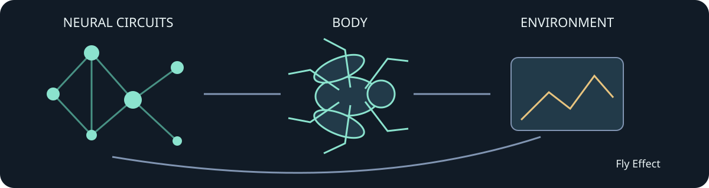

# Fly Effect

**小さな神経のつながりから、大きな理解へ。**

[English](README.en.md) · [はじめる](docs/GETTING_STARTED.md) · [参加する](CONTRIBUTING.md) · [現在地](docs/STATUS.md)

Fly Effectは、**限られた計算資源で、神経回路・身体・環境の相互作用を再現可能なソフトウェアとして探る**オープンな研究開発プロジェクトです。まずショウジョウバエを対象に、電子空間で神経のつながりを時間発展させ、筋肉や身体、感覚との循環を作ります。

知的好奇心から始まる小さな実験を、教育、基礎研究、シミュレーション技術、そして将来の医療研究にも役立つ共有財産へ育てたいと考えています。神経科学、物理、ソフトウェア、可視化、翻訳、再現実験。それぞれの得意分野を持ち寄れる場所を目指します。

## 今できること

| 項目 | 現在の範囲 |
|---|---|
| 小さな回路を試す | 外部データ不要の人工3ニューロン例。発火と保存・再開を確認 |
| 神経計算 | CPU・Brian2 NumPyでのLIF計算。元IDと固定グラフを保持 |
| 身体との結合 | 実験的な六脚身体、筋活動・張力・関節トルク、関節感覚と荷重感覚 |
| 再現性 | データハッシュ、seed、状態保存、記録された姿勢の描画 |
| 共同開発 | テスト、CI、研究提案テンプレート、貢献・運営・リリース方針 |

**現在はpre-alphaです。自律歩行・学習・飛行が完成した生物シミュレーターではありません。** ローカル研究版では六脚の接地反復を確認しましたが、3秒で約0.58mmの正味移動にとどまり、歩行条件を満たしていません。公開コードの検証、人工回路テスト、過去の研究結果は区別して報告します。[検証の範囲](docs/STATUS.md)

## まず小さく動かす

Python 3.11以上を用意し、このリポジトリで実行します。

    python -m venv .venv
    # Windows: .venv\Scripts\Activate.ps1
    # macOS / Linux: source .venv/bin/activate
    python -m pip install -e ".[dev,neural]"
    fly-effect doctor
    fly-effect demo --out work/my-first-circuit
    python -m pytest

人工回路のデモは導入・保存・再開の確認用で、ハエの再現性能の証拠ではありません。生物データ、メッシュ、学習済み重みは同梱しません。全CNS・身体実験には追加のデータと準備が必要です。[導入手順](docs/GETTING_STARTED.md) / [データ](docs/DATA.md)

## 大切にしたいこと

- **小さく確かめる。** 高価な計算の前に、小さな回路・筋肉・身体で仮説を反証する。
- **分からないことを残す。** 実測、推定、未同定、未検証を混ぜない。失敗も知識として共有する。
- **資源を尊重する。** 時間・メモリの上限を決め、大型データや同じ計算を無駄に複製しない。
- **開かれた共同作業。** 専門家でなくても質問、翻訳、文書、テストから参加できる。
- **有益な方向へ。** 科学的理解と人の暮らしに役立つ可能性を育てる。意識・完全な生物再現・臨床上の有効性を主張しない。

これらは運営理念であり、ソフトウェアのライセンスに追加の用途制限を設けるものではありません。[理念](docs/VISION.md)

## 次に取り組むこと

1. 公開された歩行リズム候補回路の、小さな再現実験。
2. 同じ筋肉・身体で支持と推進が可能かを確かめる校正。
3. 神経の位相・運動単位の募集・力の方向を照合して接続。
4. 全系へ戻し、感覚から自律的に駆動される歩行を検証。

歩行スクリプトや学習済み方策は診断・校正の教師には使えますが、実神経回路による自律歩行の成功と混同しません。[ロードマップ](docs/ROADMAP.md)

## 参加方法

バグの再現、文書の改善、小規模モデル、単位・座標のレビュー、可視化、翻訳を歓迎します。大きな実験や設計変更はIssueで仮説と計算予算を共有してください。

[最初の貢献](docs/FIRST_CONTRIBUTIONS.md) · [貢献ガイド](CONTRIBUTING.md) · [行動規範](CODE_OF_CONDUCT.md) · [運営](GOVERNANCE.md) · [セキュリティ](SECURITY.md)

## 出典とライセンス

独自コードのライセンスは[MIT](LICENSE)です。外部コード・データ・モデル資産はそれぞれのライセンスに従います。EonのGPLバックエンドや外部の生物データ・メッシュを、このリポジトリのMITへ付け替えて配布しません。

Shiuらの神経モデル、MaleCNS、NeuroMechFly/FlyGym、FlyMimic、CPG・運動制御の研究に学んでいます。各研究チームの公式プロジェクトではありません。[出典・第三者表記](THIRD_PARTY_NOTICES.md)

